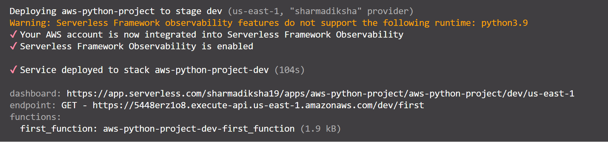
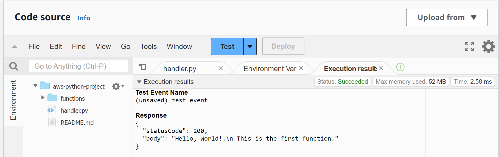

# Serverless-Computing

- Serverless computing has revolutionized the way developers build and deploy applications in the cloud.
- It takes away the complexities of server management, allowing developers to focus solely on writing code and delivering value to their users.

In the realm of serverless computing, **AWS Lambda** stands out as a leading platform for running serverless functions in a scalable and cost-effective manner.

# Serverless Framework:

- Serverless Framework is a powerful tool that simplifies the deployment and management of serverless applications in Amazon Web Services (AWS).

In this repository we will walk through the process of using the Serverless Framework to deploy a simple Python function to **AWS Lambda**, expose it via **API Gateway**, and monitor it using **AWS CloudWatch**.

# A step-by-step tutorial on deploying a serverless Python function on AWS using the Serverless Framework.

# How to set up the necessary prerequisites, including AWS account configuration.

Prerequisites

1. An AWS account

2. The AWS CLI (Command Line Interface)
   :PS C:\> msiexec.exe /i https://awscli.amazonaws.com/AWSCLIV2.msi
   :PS C:\Users\abcd> aws --version
   aws-cli/2.15.32 Python/3.11.8 Windows/10 exe/AMD64 prompt/off

3. The Serverless Framework
   Setting Up Serverless Framework With AWS
4. npm install -g serverless
5. run serverless command, follow the prompts
   https://www.serverless.com/framework/docs/providers/aws/guide/credentials/

# How to create a new serverless project using the Serverless Framework.

- This project is a simple python function that is deployed to AWS Lambda, API Gateway, and CloudWatch using the Serverless Framework.
- The function is triggered by an HTTP GET request and returns a simple string. The function is deployed to the eu-west-1 region.
- create a new Serverless Framework project using the serverless command and then follow the prompt:
  serverless
- Then choose AWS Python Starter from the template list. Give it any name of your choice – I used serverless-python-lab.
- After the command runs successfully, you will see the two main components created: serverless.yaml, and handler.py.

# How to write a Python function that will be deployed to AWS Lambda.

- Create a folder named functions, and create a file named **init**.py inside it.
  mkdir functions touch functions/**init**.py
- Create your first function by creating a file named first_function.py inside the functions folder
  touch functions/first_function.py
- Then open the first_function.py file, and paste the following Python code to define the function you'll deploy
  def first_function(event, context):
  print("The first function has been invoked!!")
  return {
  'statusCode': 200,
  'body': "Hello, World!.\n This is the first function."
  }

  Explanation:

  - code above is a simple Python function that returns a JSON object with status code and body values.
  - As you can see, we inserted the two parameters — event and context — required from the functions as a Serverless Framework convention.

# How to configure the serverless.yml

- Next, open the **handler.py** file and file and delete its content and paste the following Python code to define the handler that will be invoked when the function is triggered:
  --> from functions.first_function import first_function

- open the serverless.yaml file and delete all of its content and paste the following YAML code to define the microservice you will deploy:
  example:apply your changes carefully

          service: serverless-lab
          provider:
          name: aws
          runtime: python3.7
          lambdaHashingVersion: 20201221
          region: eu-west-1
          timeout: 10 # You set a timeout of 10 seconds for the functions
          role: arn:aws:iam::155318317806:role/serverlessLabs # Enter your Arn role here
          memorySize: 512

          functions:
          first_function:
              handler: handler.first_function
              events:
              - http:
                  path: first
                  method: get

- service specifies the name of your Serverless service or project. In this case, it's named "serverless-lab," which will be used as the service name when deploying to AWS.
- provider defines the AWS provider for your service. It specifies various configuration settings for AWS Lambda functions and other AWS resources.
  name: aws specifies that you are using AWS as your cloud provider.
  runtime: python3.7 sets the runtime for AWS Lambda functions to Python 3.7.
  lambdaHashingVersion: 20201221 specifies the Lambda function hashing version. This is an internal AWS setting.
  region: eu-west-1 specifies the AWS region where your service will be deployed. You can replace "eu-west-1" with your desired AWS region.
  timeout: 10 sets a timeout of 10 seconds for AWS Lambda functions. This means that each function should complete its execution within 10 seconds.
  role: arn:aws:iam::155318317806:role/serverlessLabs specifies the AWS IAM role ARN that your Lambda functions will assume. This role defines the permissions your functions have within AWS services. You can replace this with the ARN of your desired IAM role.
- functions defines the AWS Lambda functions in your service.
  first_function denotes the name of your AWS Lambda function.
  handler: handler.first_function specifies the entry point for this function, which is handler.first_function in the handler module. This is typically in the <module_name>.<function_name> format.
  events specifies the events that triggers the function.
  http indicates that the function is triggered by an HTTP event (API Gateway).
  path: first specifies the API endpoint path (/first) that triggers the function.
  method: get specifies that this function is triggered when an HTTP GET request is made to the specified path.

# How to deploy the Python function and API Gateway.

- serverless deploy: After a while, the deployment will be completed and you can see information like the endpoint, hosted on API Gateway, to trigger the function you just deployed.
  -The framework deployed the function on AWS Lambda and, because you attached an HTTP trigger to it. It has deployed an API on API Gateway to let the function be reachable.

# How to test the deployed API using various tools like cURL or Postman.

- From the deployment, you have a single function named first_function, and a single HTTP GET endpoint.

- Using the GET endpoint (the endpoint generated in the terminal after deploying the function) in your browser, you can call the function:
  
  
  

# How to set up monitoring and logging with AWS CloudWatch.

- The log group is automatically saved on AWS CloudWatch because there is a print statement defined in the function. Enter the following command to access the function's logs:

        serverless logs -f first_function

- **AWS CloudWatch** is the native AWS logging service that lets you monitor and access logs from your applications. You can find log groups, and you can also apply filter expressions on logs to retrieve those you need.

# Delete Microservices deployed

- You can delete the microservice and resources you just deployed using the **serverless remove** command.
